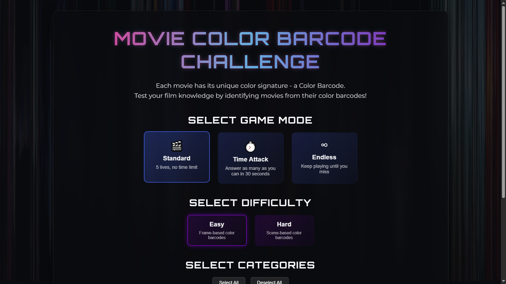
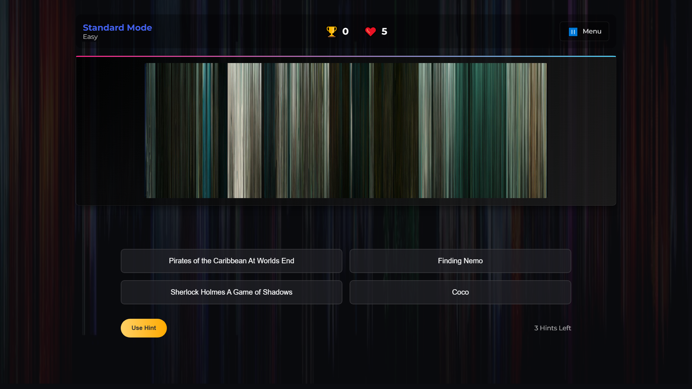
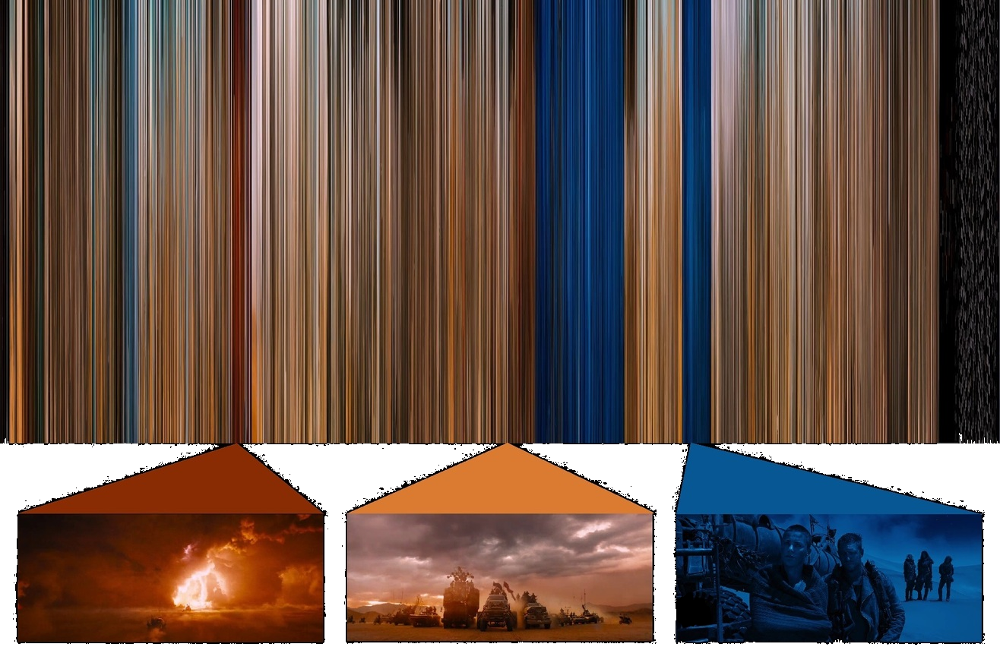

# 🎬 Movie Color Barcode Challenge





A web-based game that challenges movie enthusiasts to identify films based on their color barcodes - a visual representation of movie scenes compressed into vertical color strips arranged chronologically.



## 🌟 Features

- **Multiple Game Modes**:
  - **Standard**: 5 lives, unlimited time
  - **Time Attack**: 30-second timer with +15 seconds bonus for every 5 correct answers
  - **Endless**: Continue until your first wrong answer

- **Two Difficulty Levels**:
  - **Easy**: Frame-based color barcodes (more detailed)
  - **Hard**: Scene-based color barcodes (simplified)

- **Category Filtering**: Select specific movie genres to customize your game experience

- **Hint System**: Use hints to eliminate incorrect options

- **High Score Tracking**: Save and view your best performances

- **Responsive Design**: Play on desktop, tablet, or mobile devices

- **Offline Support**: Play without an internet connection after initial load

## 🎮 How to Play

1. Movie Color Barcodes are visual representations of films where each vertical line represents the dominant colors of frames arranged chronologically.
2. Look for color patterns that might indicate specific scenes, transitions, or the overall mood of a film.
3. Select the correct movie title from four options.
4. Use hints strategically when you're not sure!

## 🛠️ Technologies

- HTML5
- CSS3 with CSS Variables
- Vanilla JavaScript (ES6+)
- LocalStorage API
- Service Workers for offline capability
- Responsive Design

## 📋 Prerequisites

- Any modern web browser (Chrome, Firefox, Safari, Edge)

## ⚙️ Installation & Deployment

### Local Development

1. Clone this repository:
   ```bash
   git clone https://github.com/AkashKK25/movei-color-barcode-game-ghp.git
   cd cinematic-barcode-challenge
   ```

2. Open the project in your code editor

3. For local testing, you can use any of these methods:
   
   **Using VS Code Live Server extension:**
   - Install the Live Server extension
   - Right-click on `index.html` and select "Open with Live Server"
   
   **Using Python's built-in server:**
   ```bash
   # Python 3
   python -m http.server
   
   # Python 2
   python -m SimpleHTTPServer
   ```
   
   **Using Node.js and http-server:**
   ```bash
   # Install http-server globally if you haven't already
   npm install -g http-server
   
   # Run the server
   http-server
   ```

4. Visit `http://localhost:8000` or the URL provided by your server

## 📁 Project Structure

```
movie-color-barcode-challenge/
├── index.html               # Main HTML file
├── css/
│   └── style.css            # Main stylesheet
├── js/
│   ├── app.js               # Main application entry point
│   ├── gameEngine.js        # Game logic
│   └── animations.js        # UI animations
├── assets/
│   ├── images/
│   │   ├── background-barcode.png  # Background image
│   │   └── favicon.ico      # Site favicon
│   └── sounds/
│       ├── correct.mp3      # Sound effects
│       ├── wrong.mp3
│       ├── game-over.mp3
│       ├── tick.mp3
│       └── start.mp3
├── data/
│   ├── categories.js        # Movie categories
│   ├── easy.js              # Easy-mode movie data
│   └── hard.js              # Hard-mode movie data
├── Movie Color Barcodes Easy/  # Easy-mode barcode images
├── Movie Color Barcodes Hard/  # Hard-mode barcode images
└── service-worker.js        # Service worker for offline support
```

## 🎬 Adding Your Own Movie Barcodes

### Option 1: Using Python MoviePy

1. Install Python and MoviePy:
   ```bash
   pip install moviepy numpy pillow
   ```

2. Use this script to generate barcodes:
   ```python
   from moviepy.editor import VideoFileClip
   import numpy as np
   from PIL import Image

   def create_movie_barcode(video_path, output_path, sample_rate=1):
       # Load video
       clip = VideoFileClip(video_path)
       
       # Calculate number of frames to sample
       total_frames = int(clip.fps * clip.duration)
       sample_frames = total_frames // sample_rate
       
       # Extract average colors
       colors = []
       for i in range(0, total_frames, sample_rate):
           t = i / clip.fps
           if t >= clip.duration:
               break
           frame = clip.get_frame(t)
           avg_color = np.mean(frame, axis=(0, 1)).astype(np.uint8)
           colors.append(avg_color)
       
       # Create barcode image
       width = len(colors)
       height = 500
       barcode = Image.new('RGB', (width, height))
       
       # Draw vertical lines
       for x, color in enumerate(colors):
           for y in range(height):
               barcode.putpixel((x, y), tuple(color))
       
       # Save image
       barcode.save(output_path)
       
       # Close video
       clip.close()

   # Example usage
   create_movie_barcode("your_movie.mp4", "movie_color_barcode_Your_Movie.jpg")
   ```

3. Update the movie data files with your new barcodes:
   - Add entries to `data/easy.js` or `data/hard.js`
   - Follow the format of existing entries:
     ```javascript
     {
         id: 123,
         name: "Your Movie Title",
         fileName: "movie_color_barcode_Your_Movie.jpg",
         category: "action", // use a category ID from categories.js
         year: 2023,
         director: "Director Name"
     }
     ```

### Option 2: Using Online Tools

1. Search for "movie barcode generator" tools online
2. Upload your video file
3. Download the generated barcode
4. Name it following the format: `movie_color_barcode_[MOVIE_NAME].jpg`
5. Add it to the appropriate folder and update data files

## 🙏 Acknowledgements

- Inspired by the work of movie barcode creators across the web
- Sound effects from [Freesound.org](https://freesound.org/)
- Fonts from [Google Fonts](https://fonts.google.com/)

## 🤝 Contributing

Contributions, issues, and feature requests are welcome! Feel free to check the issues page.

1. Fork the project
2. Create your feature branch (`git checkout -b feature/feature_1`)
3. Commit your changes (`git commit -m 'Adding some feature'`)
4. Push to the branch (`git push origin feature/feature`)
5. Open a Pull Request

---

Created with ❤️ by [Akash Kondaparthi]()
